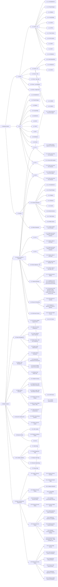

```mermaid
graph LR
    A[1 Hardware System]

    A --> B1[1.1 Drone]
    B1 --> C11[1.1.1 Drone - CC]

    C11 --> D111[1.1.1.1 CPU/DDR/UFS]
    C11 --> D112[1.1.1.2 Power/Charger]
    C11 --> D113[1.1.1.3 Battery]
    C11 --> D114[1.1.1.4 Long Range]
    C11 --> D115[1.1.1.5 GPS]
    C11 --> D116[1.1.1.6 TPM]
    C11 --> D117[1.1.1.7 Navi Camera]
    C11 --> D118[1.1.1.8 VIO Camera]
    C11 --> D119[1.1.1.9 WiFi]
    C11 --> D1110[1.1.1.10 BT]
    C11 --> D1111[1.1.1.11 5GModem]

    B1 --> C12[1.1.2 Drone - FC]
    C12 --> D121[1.1.2.1 MCU/Flash/RAM]
    C12 --> D122[1.1.2.2 SiK/ELRS]
    C12 --> D123[1.1.2.3 GPS]
    C12 --> D124[1.1.2.4 SE050]
    C12 --> D125[1.1.2.5 IOMCU]

    B1 --> C13[1.1.3 Drone - ESC]
    B1 --> C14[1.1.4 Drone - Spot Light]
    B1 --> C15[1.1.5 Drone - Loud Speaker]
    B1 --> C16[1.1.6 Drone - Night Sense]

    A --> B2[1.2 RC]
    B2 --> C21[1.2.1 CPU/DDR/UFS]
    B2 --> C22[1.2.2 Power/Charger]
    B2 --> C23[1.2.3 Battery]
    B2 --> C24[1.2.4 Long Range]
    B2 --> C25[1.2.5 SiK/ELRS]
    B2 --> C26[1.2.6 GPS]
    B2 --> C27[1.2.7 WiFi]
    B2 --> C28[1.2.8 BT]
    B2 --> C29[1.2.9 5GModem]
    B2 --> C210[1.2.10 Panel]
    B2 --> C211[1.2.11 Audio]
    B2 --> C212[1.2.12 Joystick]
    B2 --> C213[1.2.13 HDMI]
    
    A --> B3[1.3 Gimbal]
    B3 --> C31[1.3.1 Camera Subsystem]
    C31 --> D131[1.3.1.1 CPU/DDR/UFS]
    C31 --> D132[1.3.1.2 Power/Charger]
    C31 --> D133[1.3.1.3 Battery]
    C31 --> D134[1.3.1.4 Ethernet]
    C31 --> D135[1.3.1.5 USB]
    C31 --> D136[1.3.1.6 Normal Camera]
    C31 --> D137[1.3.1.7 Tele Camera]
    C31 --> D138[1.3.1.8 Wide Camera]

    B3 --> C32[1.3.2 Motor Subsystem]
    C32 --> D231[1.3.2.1 Support needed from 3rd Vendor]

    A2["2 Software System"]

    %% 2.1 Fleet Management
    A2 --> B21["2.1 Device Activation & Verification"]
    B21 --> C211["2.1.1 CC"]
    C211 --> D2111["2.1.1.1 Secure Boot and Trust Zone support"]
    C211 --> D2112["2.1.1.2 Define all keys required for CC/FC/GB"]
    C211 --> D2113["2.1.1.3 Store secure keys into safe place"]

    B21 --> C212["2.1.2 FC"]
    C212 --> D2121["2.1.2.1 Secure Boot support"]
    C212 --> D2122["2.1.2.2 Store secure keys into safe place"]

    B21 --> C213["2.1.3 GB"]
    C213 --> D2131["2.1.3.1 Secure Boot and Trust Zone support"]
    C213 --> D2132["2.1.3.2 Store secure keys into safe place"]

    B21 --> C214["2.1.4 CC"]
    C214 --> D2141["2.1.4.1 Detect and correct hardware component deviations"]
    C214 --> D2142["2.1.4.2 Status ready on LED status"]

    B21 --> C215["2.1.5 FC"]
    C215 --> D2151["2.1.5.1 Detect and correct hardware component deviations"]
    C215 --> D2152["2.1.5.2 Status ready on LED status"]

    B21 --> C216["2.1.6 Device diagnosis - GB"]
    C216 --> D2161["2.1.6.1 Detect and correct hardware -GB"]
    C216 --> D2162["2.1.6.2 Status ready on LED status -GB"]

    B21 --> C217["2.1.7 Network Bootstrap"]
    C217 --> D2171["2.1.7.1 Internet Acccess Method"]
    C217 --> D2172["2.1.7.2 Cellphone as the role of WiFi Hotspot and BLE provisioning controller"]
    C217 --> D2173["2.1.7.3 The process of BT BLE/GATT profile information for WiFi Hotspot, and the message format for that"]

    B21 --> C218["2.1.8 Secure On Boarding"]
    C218 --> D2181["2.1.8.1 FDO Secure on boarding"]
    C218 --> D2182["2.1.8.2 Register to lighthouse for overlay IP operation"]

    B21 --> C219["2.1.9 Call Home Process"]
    C219 --> D2191["2.1.9.1 Call Home Agent Process"]

    B21 --> C2110["2.1.10 Firmware Updates Support-FOTA"]
    C2110 --> D21101["2.1.10.1 IoT Server"]
    C2110 --> D21102["2.1.10.2 MP Server"]

    %% 2.2
    A2 --> B22["2.2 Swarm Management"]
    B22 --> C221["2.2.1 Web UI for Swam Management"]
    B22 --> C222["2.2.2 Check selected Swarm Inspection"]
    B22 --> C223["2.2.3 Swarm setup - team and configuration"]
    B22 --> C224["2.2.4 Swarm setup - default Swarm"]

    %% 2.3
    A2 --> B23["2.3 Mission Task Management"]
    B23 --> C231["2.3.1 Define Mission Parameters"]
    B23 --> C232["2.3.2 Government Restricted Zone Map Data"]
    B23 --> C233["2.3.3 Expand Preflight check Go No-Go gate"]
    B23 --> C234["2.3.4 Mission Task - Default Task"]

    %% 2.4
    A2 --> B24["2.4 Flight Mission Execusion"]
    B24 --> C241["2.4.1 Failsafe Functions"]
    B24 --> C242["2.4.2 Single-Drone: Real-Time Mission Monitoring"]
    B24 --> C243["2.4.3 Swarm Lobby: Real-Time Mission Overview"]
    B24 --> C244["2.4.4 Gimbal Control and Settings"]
    B24 --> C245["2.4.5 Main Camera (Wide / Narrow / Tele)"]

    %% 2.5
    A2 --> B25["2.5 Drone RC Interface API"]
    B25 --> C251["2.5.1 Define Mavlink V2 command sets"]
    B25 --> C252["2.5.2 Define Yang Schema operation"]
    B25 --> C253["2.5.3 Define extra API needed "]

    %% 2.6
    A2 --> B26["2.6 Real-time Flight"]
    B26 --> C261["2.6.1 GNC module"]
    B26 --> C262["2.6.2 Obstacle avoidance module"]
    B26 --> C263["2.6.3 VIO"]

    %% 2.7
    A2 --> B27["2.7 RC UI/Menu defintion"]
    B27 --> C271["2.7.1 Main Page"]
    B27 --> C272["2.7.2 Fleet Management Page"]
    B27 --> C273["2.7.3 Mission Task Page"]
    B27 --> C274["2.7.4 Real-time Flight Page"]
    B27 --> C275["2.7.5 Setup Page"]

    %% 2.8
    A2 --> B28["2.8 Taiwan CyberSecurity Requirement"]
    B28 --> C281["2.8.1 System Security Testing"]
    C281 --> D2811["2.8.1.1 Identity Authentication"]
    C281 --> D2812["2.8.1.2 Network Service Scanning"]
    C281 --> D2813["2.8.1.3 Abnormal System Traffic"]

    B28 --> C282["2.8.2 Software Security Testing"]
    C282 --> D2821["2.8.2.1 Malware Detection"]
    C282 --> D2822["2.8.2.2 Vulnerability Scanning"]

    B28 --> C283["2.8.3 Communication Security Testing"]
    C283 --> D2831["2.8.3.1 Wireless Communication Security"]

    B28 --> C284["2.8.4 Firmware Security Testing"]
    C284 --> D2841["2.8.4.1 Firmware Update Security"]

    B28 --> C285["2.8.5 General Security Testing"]
    C285 --> D2851["2.8.5.1 GNSS Positioning System Resilience"]
    C285 --> D2852["2.8.5.2 GNSS Anti-Interference Capability"]
    C285 --> D2853["2.8.5.3 Mobile App Basic Security Posture"]
    C285 --> D2854["2.8.5.4 Wireless Communication Failure Handling"]
    C285 --> D2855["2.8.5.5 Firmware Known Vulnerability Scan – Flight Controller (FC)"]

    B28 --> C286["2.8.6 Advanced Security Testing"]
    C286 --> D2861["2.8.6.1 Data Storage Security"]
    C286 --> D2862["2.8.6.2 UAV Command & Control C2 Protection"]
    C286 --> D2863["2.8.6.3 Engineering / Debug Interfaces"]
    C286 --> D2864["2.8.6.4 Source Code Security Review"]
    C286 --> D2865["2.8.6.5 Undisclosed Applications / Services"]
    C286 --> D2866["2.8.6.6 Software Update Security GCS/System"]
```
